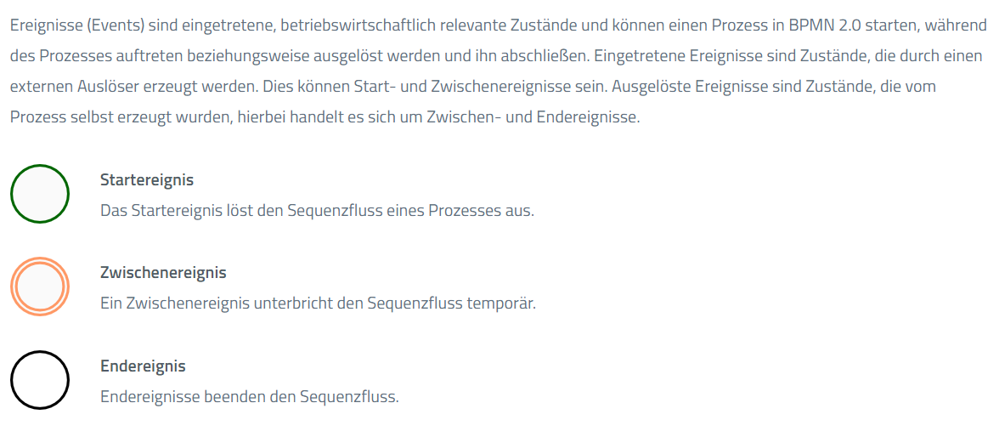
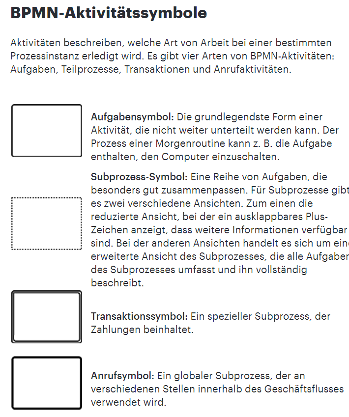
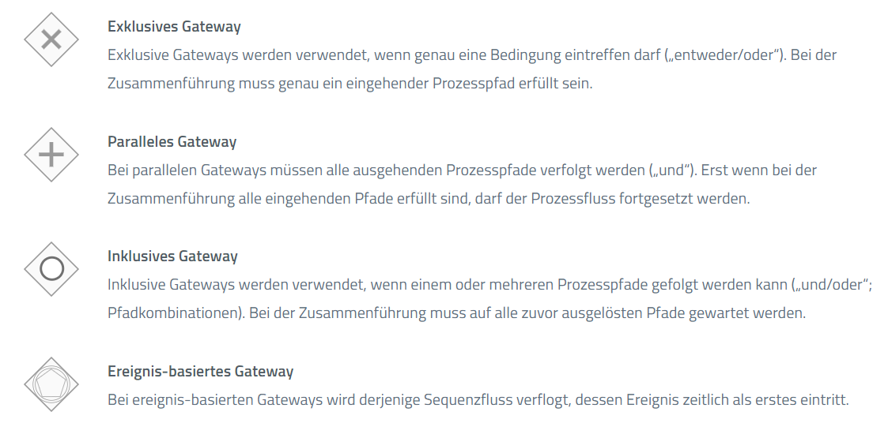
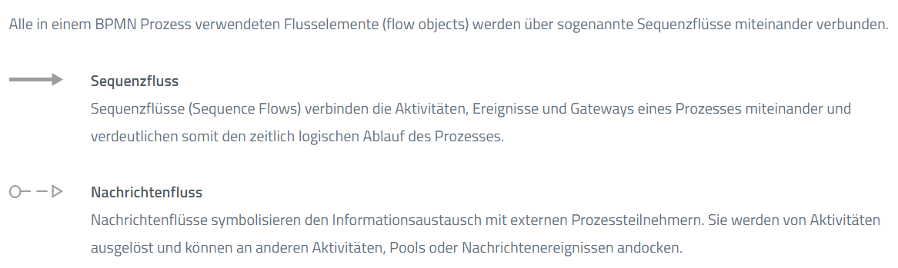
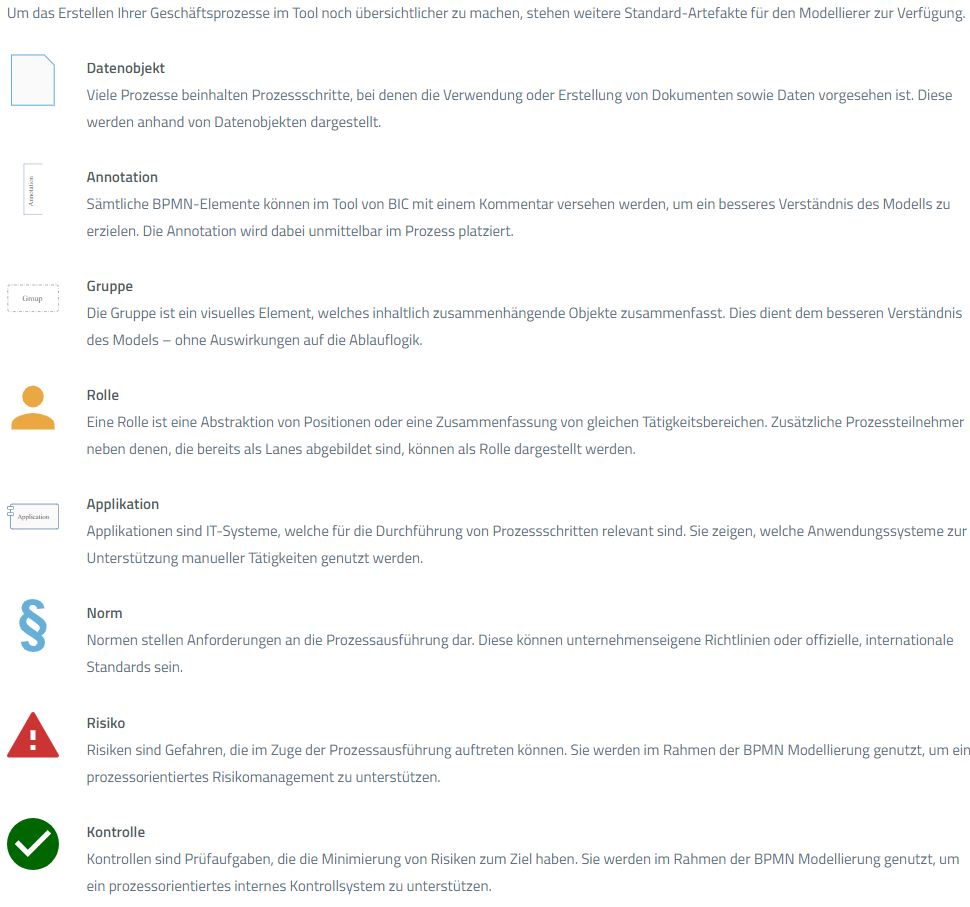

# Symbols

## Ereignisse

## Aktivitäten

## Gateways

Exklusives Gateway = XOR - Gateway
Paralleles Gateway = AND - Gateway -> Alle ausgehende Sequenzflüsse werden auf einmal ausgeführt

## Verbinden

## Artefakte

[BPMN 2.0 Symbols - A complete guide with examples. | Camunda](https://camunda.com/bpmn/reference/)