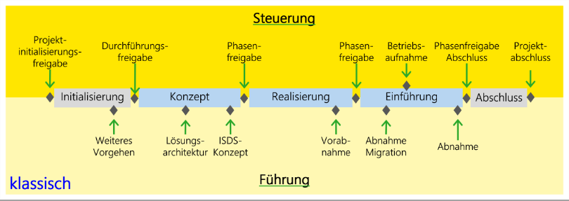

# Hermes

## Was ist Hermes?
    HERMES ist die Projektmanagement-Methode für Projekte im Bereich der Informatik, der Entwicklung von Dienstleistungen und Produkten sowie der Anpassung der Geschäftsorganisation. HERMES unterstützt die Steuerung, Führung und Ausführung von Projekten verschiedener Charakteristiken und Komplexität. HERMES hat eine klare, einfach verständliche Methodenstruktur, ist modular aufgebaut und erweiterbar.
 
    HERMES wird von der schweizerischen Bundesverwaltung entwickelt, steht als offener Standard frei zur Verfügung

Die Methode besteht aus einem umfassenden Handbuch, das verschiedene Aspekte des Projektmanagements abdeckt. Zu den wichtigsten Merkmalen von Hermes gehören: 

1. Phasen: 

    Das HERMES-Phasenmodell für Projekte bildet das Rückgrat jedes Projekts. Es schafft die Voraussetzung für das gemeinsame Verständnis aller Projektbeteiligten. Dies ist eine wichtige Voraussetzung für die erfolgreiche organisationsübergreifende Abwicklung der Projekte.
    

2. Szenarien: 

    In einer Stammorganisation werden unterschiedliche Projekte durchgeführt. Die Projekte können sich bezüglich ihres Inhalts und der Komplexität stark unterscheiden. Um der Vielfalt der Projekte gerecht zu werden, bietet HERMES-Projektmanagement Szenarien an. Ein Szenario wird im Projekt für das zwischen der Initialisierung und Abschluss eingeschlossene Entwicklungsvorgehen bestimmt, also bei der klassischen Vorgehensweise für die Phasen Konzept, Realisierung und Einführung und bei der agilen Vorgehensweise für die Phase Umsetzung.

3. Module: 

    Module sind wiederverwendbare, den Phasen zugeordnete Bausteine zur Erstellung von Projekten und Szenarien.. Thematisch zusammengehörende Ergebnisse und die mit ihnen verknüpften Aufgaben bilden ein Modul
     
4. Ergebnisse: 

    Für jedes Ergebnis gibt es eine Ergebnisbeschreibung. Für alle Dokumente gibt es Dokumentvorlagen, die den in den Ergebnissen aufgeführten Inhalt detaillierter beschreiben. Jedem Ergebnis sind Aufgaben und Rollen zugeordnet. Die Rollen geben einen Hinweis darauf, wie die Verantwortung für Ergebnisse und die Beteiligung bei der Ergebniserstellung geregelt ist.

    HERMES definiert minimal geforderte Dokumente (Ergebnisse), um die Anforderungen an die Projekt-Governance zu erfüllen.

5. Aufgaben: 
    
    Die Aufgaben dienen der Erarbeitung von Ergebnissen. Thematisch zusammengehörende Ergebnisse samt zugeordneten Aufgaben bilden Module.

    Für jede Aufgabe gibt es eine Aufgabenbeschreibung. Sie definiert das generelle Vorgehen und die Aktivitäten, die unternommen werden, um die Ergebnisse zu erarbeiten. Die Rollen geben einen Hinweis darauf, welcher Rolle die Verantwortung für eine Aufgabe zugeordnet ist.

6. Rollen

    HERMES-Projektmanagement unterscheidet zwischen den Rollen der Stammorganisation und Rollen der Projektorganisation, beschreibt jedoch ausschliesslich die HERMES-Rollen der Projektorganisation. Für jede Rolle gibt es eine Rollenbeschreibung mit Verantwortung, den Kompetenzen und den benötigten Fähigkeiten sowie mit ihren Beziehungen. Jede Rolle ist einer der Hierarchieebenen Steuerung, Führung oder Ausführung zugeordnet. Es sind unterschiedliche Rollen definiert, die nach Bedarf verwendet werden können.

## Was kann Hermes?

### Vorteile / Nachteile

#### Vorteile:

1. Standardisiertes Vorgehen: 
    HERMES bietet ein strukturiertes und standardisiertes Vorgehen für Projektmanagement, was dazu beiträgt, dass Projekte effizient und zielorientiert durchgeführt werden können.

2. Flexibilität:
    HERMES ist eine flexible Methode, die auf die Bedürfnisse des Projekts angepasst werden kann. Es bietet verschiedene Vorgehensmodelle und Phasen, die je nach Projekt unterschiedlich eingesetzt werden können.

3. Klare Rollen und Verantwortlichkeiten:
    HERMES definiert klare Rollen und Verantwortlichkeiten für die Projektbeteiligten, was dazu beiträgt, dass das Projektteam effektiv zusammenarbeiten und das Projektziel erreichen kann.

#### Nachteile:

1. Komplexität:
    Die HERMES-Methode kann für unerfahrene Projektmanager oder für kleine Projekte als zu komplex empfunden werden.

2. Dokumentationsaufwand:
    Die HERMES-Methode legt großen Wert auf Dokumentation und Berichtswesen, was für manche Projekte einen höheren Aufwand bedeutet.

3. Begrenzte Anpassung:
    Obwohl HERMES flexibel ist, kann es schwierig sein, die Methode für bestimmte Projekte oder Branchen anzupassen, da sie ursprünglich für die Verwaltung von IT-Projekten entwickelt wurde.

### Einsatzzweck von Hermes

HERMES ist eine Projektmanagement-Methode, die in der Schweiz entwickelt wurde und auch in anderen Ländern eingesetzt wird. Die Methode hat ihren Schwerpunkt auf der Durchführung von IT-Projekten, kann aber auch für andere Arten von Projekten angewendet werden.

Der Einsatzzweck von HERMES besteht darin, eine strukturierte und standardisierte Vorgehensweise für die Planung, Durchführung und Kontrolle von Projekten zu bieten. Durch die klare Definition von Rollen, Verantwortlichkeiten und Prozessen soll sichergestellt werden, dass Projekte effektiv und effizient durchgeführt werden und die Projektziele erreicht werden können. HERMES bietet dabei eine hohe Flexibilität, sodass die Methode je nach Projektart und Projektumfang angepasst werden kann.

Insgesamt eignet sich HERMES insbesondere für komplexe Projekte mit vielen Beteiligten und einem hohen Risiko- und Veränderungsmanagementbedarf. HERMES stellt sicher, dass Projekte transparent und nachvollziehbar durchgeführt werden und so ein hoher Projekterfolg erzielt wird.
		
## Wie geht man mit Hermes vor?

### Klassisch

1. Initiation:
    In dieser Phase wird das Projekt initialisiert. Das bedeutet, dass das Projektziel, der Projektauftrag, die Rahmenbedingungen und die Projektorganisation festgelegt werden.

2. Konzeption:
    In dieser Phase wird das Projektkonzept ausgearbeitet. Das bedeutet, dass das Lasten- und Pflichtenheft erstellt wird, die Risiken identifiziert werden und das Projektbudget festgelegt wird.

3. Realisierung:
    In dieser Phase wird das Projekt umgesetzt. Das bedeutet, dass das Projektteam die Arbeitspakete und Meilensteine festlegt, die Aufgaben verteilt und die Arbeit durchführt.

4. Einführung:
    In dieser Phase wird das Projekt implementiert. Das bedeutet, dass die Ergebnisse des Projekts in Betrieb genommen werden, Schulungen durchgeführt werden und eine Support-Organisation aufgebaut wird.

5. Abschluss:
    In dieser Phase wird das Projekt abgeschlossen. Das bedeutet, dass eine Abschlussdokumentation erstellt wird, die Ergebnisse bewertet und die Projekterfahrungen dokumentiert werden.

Mit diese Methode werden Meilensteine abgearbeitet.

### Agil

1. Initiation:
    In dieser Phase wird das Projekt initialisiert. Das bedeutet, dass das Projektziel, der Projektauftrag, die Rahmenbedingungen und die Projektorganisation festgelegt werden.

2. Umsetzung:
    Die Umsetzungsphase, fässt als Agile-Methode die 3 Phasen "Konzeption,Realisierung und Einführung" zusammen.
    Die Lösungsanforderungen werden weiter aufgeteilt, verfeinert und konkretisiert. Die Anforderungen werden aktualisiert und priorisiert und nach absteigender Priorität abgearbeitet (entwickelt, realisiert und in Betrieb genommen), wobei die Prioritäten kontinuierlich aktualisiert und den Projekterkenntnissen entsprechend angepasst. Dadurch wird das ganze Projekt agiler.

5.  Abschluss:
    In dieser Phase wird das Projekt abgeschlossen. Das bedeutet, dass eine Abschlussdokumentation erstellt wird, die Ergebnisse bewertet und die Projekterfahrungen dokumentiert werden.

Mit dieser Methode wird mit Releases und Releasefreigaben gearbeitet.

 

		
### Praxisbeispiel

## Abschluss